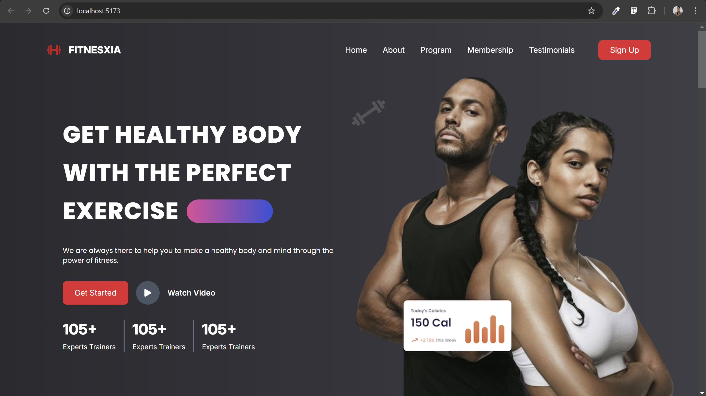

# Fitnesxia - Gym Fitness Website

Fitnesxia is a sleek Single Page Application (SPA) built using React and Tailwind CSS.

## Tech Stack

- **Vite**: For fast development and build tooling.
- **React.js**: For building the user interface.
- **Tailwind CSS**: For styling.


## Prerequisites

Before getting started, ensure you have the following installed:

- [Node.js](https://nodejs.org/en/) (v16.0 or higher)
- [npm](https://www.npmjs.com/) (or yarn, if you prefer)

## Getting Started

To get the project up and running locally, follow these steps:

1. Clone this repository to your local machine:

   ```bash
   git clone https://github.com/gauravshresthaofficial/spa.git
   cd spa
   ```

2. Install dependencies:

   Using `npm`:
   ```bash
   npm install
   ```

   Or using `yarn`:
   ```bash
   yarn install
   ```

3. Run the development server:

   Using `npm`:
   ```bash
   npm run dev
   ```

   Or using `yarn`:
   ```bash
   yarn dev
   ```

   This will start the Vite development server. You should be able to view the app at http://localhost:5173/.
   
   ## Screenshot
   

   ## Live View
   Experience the live app: https://spa-alpha-roan.vercel.app/
